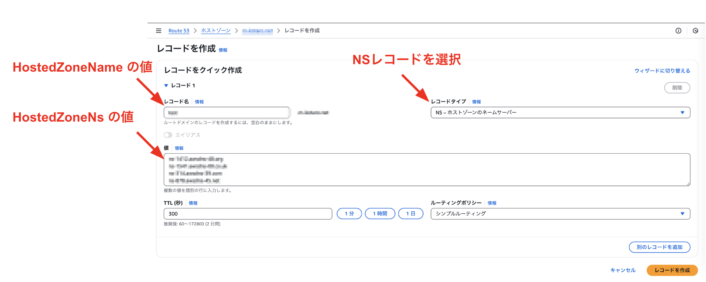

# 00_hostedzone

## 概要

DNSおよびドメインの登録と証明書の構築。

---

## 構築リソース

---

## 環境変数設定

```bash
SYSTEM_ENV=# your system env
DOMAIN_NAME=# your Domain
```

---

## 01_hostedzone

### CloudFormation実行

```bash
aws cloudformation create-stack --stack-name stack-email-uploader-$SYSTEM_ENV-hostedzone --template-body file://template/00_hostedzone/01_hostedzone.yml --parameters ParameterKey=SystemEnv,ParameterValue=$SYSTEM_ENV ParameterKey=DomainName,ParameterValue=$DOMAIN_NAME --region us-east-1
aws cloudformation wait stack-create-complete --stack-name stack-email-uploader-$SYSTEM_ENV-hostedzone --region us-east-1

```

### NSレコード取得

下記コマンドを実行

```bash
export HOSTEDZONE_OUTPUTS=$(aws cloudformation describe-stacks --stack-name stack-email-uploader-$SYSTEM_ENV-hostedzone --query "Stacks[0].Outputs" --output json --region us-east-1)

export HOSTEDZONE_ID=$(echo "$HOSTEDZONE_OUTPUTS" | jq -r '.[] | select(.OutputKey=="HostedZoneId") | .OutputValue')
export HOSTEDZONE_NAME=$(echo "$HOSTEDZONE_OUTPUTS" | jq -r '.[] | select(.OutputKey=="HostedZoneName") | .OutputValue')
export HOSTEDZONE_NS=$(echo "$HOSTEDZONE_OUTPUTS" | jq -r '.[] | select(.OutputKey=="HostedZoneNs") | .OutputValue')

echo -e "## HostedZoneNs\n$(echo "$HOSTEDZONE_NS" | tr ',' '\n')\n\n## HostedZoneName\n$HOSTEDZONE_NAME"

```

### 上位ドメインNSレコード登録

得られたNSレコードを上位ドメインに登録する。

※図は上位ドメインがAWS Route53である場合



---

## 02_acm

### CloudFormation実行

```bash
aws cloudformation create-stack --stack-name stack-email-uploader-$SYSTEM_ENV-acm --template-body file://template/00_hostedzone/02_acm.yml --parameters ParameterKey=SystemEnv,ParameterValue=$SYSTEM_ENV --region us-east-1
aws cloudformation wait stack-create-complete --stack-name stack-email-uploader-$SYSTEM_ENV-acm --region us-east-1

```

---

## 03_parameterstore

### CloudFormation実行

```bash
export HOSTEDZONE_OUTPUTS=$(aws cloudformation describe-stacks --stack-name stack-email-uploader-$SYSTEM_ENV-hostedzone --query "Stacks[0].Outputs" --output json --region us-east-1)

export HOSTEDZONE_ID=$(echo "$HOSTEDZONE_OUTPUTS" | jq -r '.[] | select(.OutputKey=="HostedZoneId") | .OutputValue')
export HOSTEDZONE_NAME=$(echo "$HOSTEDZONE_OUTPUTS" | jq -r '.[] | select(.OutputKey=="HostedZoneName") | .OutputValue')

aws cloudformation create-stack --stack-name stack-email-uploader-$SYSTEM_ENV-parameterstore --template-body file://template/00_hostedzone/03_parameterstore.yml --parameters ParameterKey=SystemEnv,ParameterValue=$SYSTEM_ENV ParameterKey=HostedZoneId,ParameterValue=$HOSTEDZONE_ID ParameterKey=HostedZoneName,ParameterValue=$HOSTEDZONE_NAME

aws cloudformation wait stack-create-complete --stack-name stack-email-uploader-$SYSTEM_ENV-parameterstore

```
