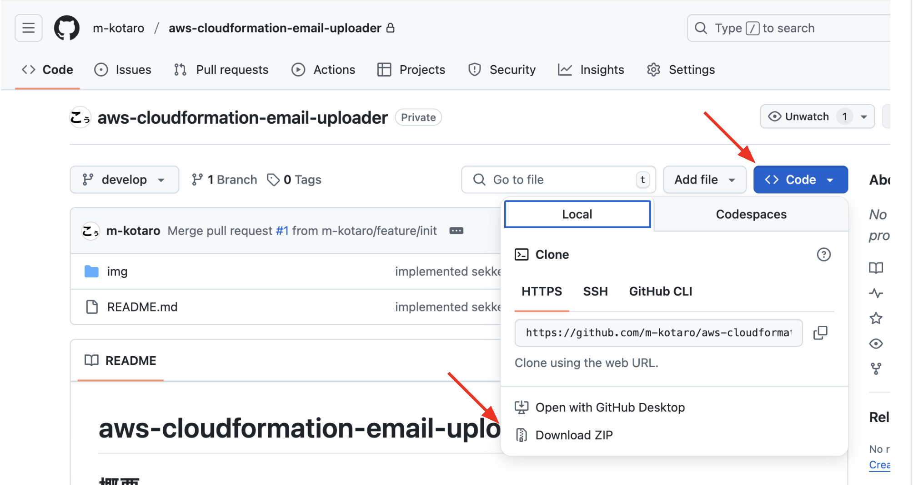
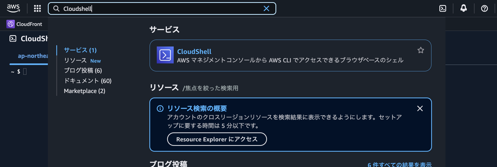
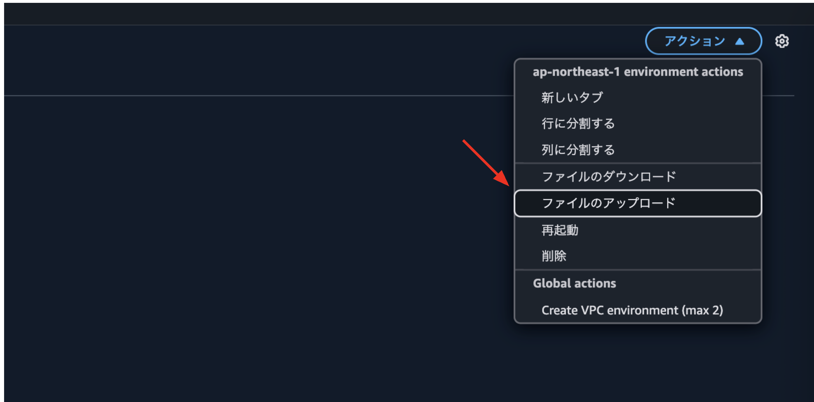
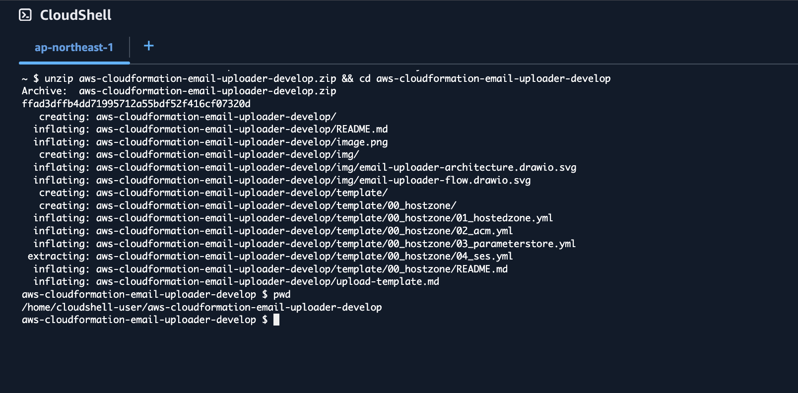

# テンプレートアップロード手順


## 概要

テンプレートのアップロード手順を記します。

---

## Zipダウンロード

Zipファイルをリポジトリからダウンロード。



---

## CloudShell起動

CloudShellを起動。



---

## アップロード

右上のアクションより、アップロードをクリック。



---

## ファイル選択

アップロードするファイルを選択。


---

## 解凍

下記コマンドを実行。

```bash
unzip aws-cloudformation-email-uploader-main.zip && cd aws-cloudformation-email-uploader-main
```



解凍したら各READMEに従って構築を行う。

