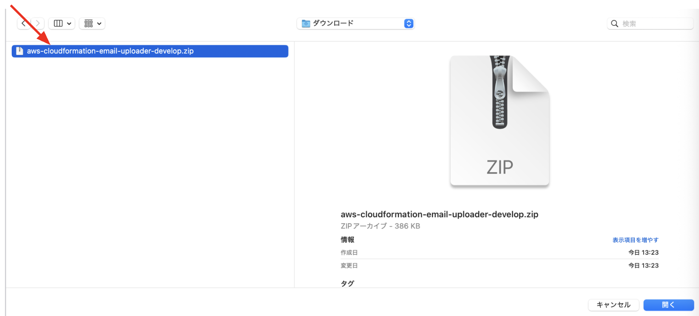

# テンプレートアップロード手順


## 概要

テンプレートのアップロード手順を記します。

---

## Zipダウンロード

Zipファイルをリポジトリからダウンロード。


---

## CloudShell起動

CloudShellを起動。


---

## アップロード

右上のアクションより、アップロードをクリック。


---

## ファイル選択

アップロードするファイルを選択。




---

## 解凍

下記コマンドを実行。

```bash
unzip aws-cloudformation-email-uploader-main.zip && cd aws-cloudformation-email-uploader-main
```


解凍したら各READMEに従って構築を行う。

